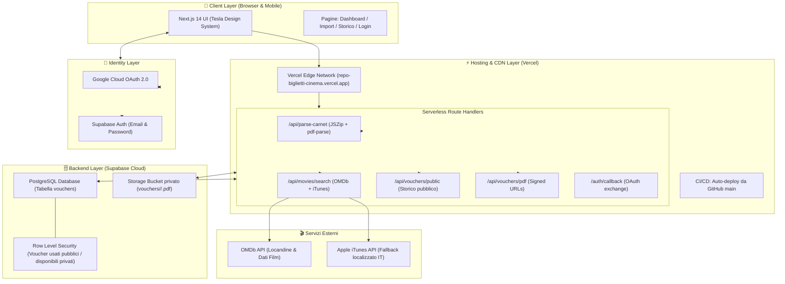
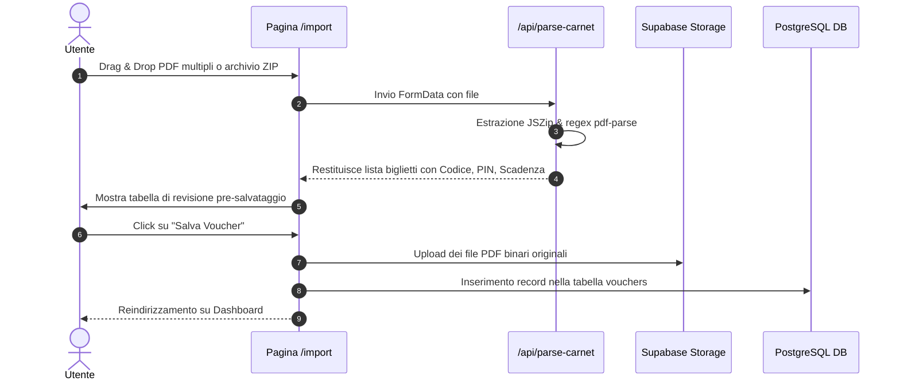
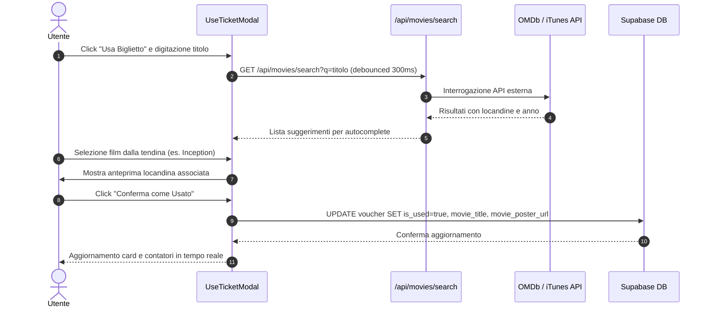

# 🏛️ CinePass Vault — Documento di Architettura di Sistema

> **Sistema di archiviazione, tracciamento e gestione intelligente per carnet di biglietti cinema "The Space Cinema".**

---

## 🗺️ Schema Architetturale Generale



---

## 1. 📱 Frontend & User Experience Layer

* **Framework Core**: [Next.js 14](https://nextjs.org/) con **App Router** (architettura ibrida Server Components e Client Components reattivi).
* **Linguaggio**: [TypeScript](https://www.typescriptlang.org/) con tipizzazione strict (`Voucher`, `ParsedTicket`, `MovieSearchResult`, `DashboardStats`).
* **Design System**: basato sulle specifiche del **Tesla Design System (Refero)**:
  * *Color Palette*:
    * Tesla Blue (`#3e6ae1`): azioni primarie, focus e stati attivi.
    * Tesla Onyx (`#171a20`): testo principale e intestazioni ad alto contrasto.
    * Charcoal (`#393c41`) & Steel (`#5c5e62`): label, icone e metadati secondari.
    * Off-White (`#f5f5f7`): sfondi container, tabelle e badge.
    * Pure White (`#ffffff`): card, modali e superfici elevate.
  * *Geometrie & Spaziature*: raggi minimali squadrati (4px per pulsanti e campi di input, 8px per card e modali).
* **Componenti Modulari**:
  * `Header.tsx`: barra di navigazione con ascolto in tempo reale della sessione, avatar dinamico e controllo di visibilità basato sullo stato di login.
  * `TicketCard.tsx`: scheda voucher a forma di pass con badge reattivi di scadenza ($\le 30$ giorni con alert animato), pulsanti 1-click *"Copia Codice"* e *"Copia PIN"* e miniatura della copertina.
  * `UseTicketModal.tsx`: modale per la registrazione dell'uso del biglietto con **autocomplete in tempo reale** per la selezione del film e recupero della locandina.
  * `PdfViewerModal.tsx`: visualizzatore incorporato del **documento PDF originale** recuperato in streaming sicuro tramite URL firmato da Supabase Storage.

---

## 2. ⚡ Serverless API Route Handlers

Tutta la logica di backend viene eseguita come funzioni serverless su Vercel Edge/Node.js runtime:

| Route Handler | Metodo | Descrizione |
| :--- | :--- | :--- |
| **`/api/parse-carnet`** | `POST` | Ingestione ed estrazione massiva. Accetta più file PDF o un archivio compresso `.zip`, decomprime in memoria (`JSZip`) ed estrae via regex (`pdf-parse`) codice biglietto (`MR...`), PIN, data di scadenza e beneficiario. Restituisce i dati strutturati e i file binari. |
| **`/api/movies/search`** | `GET` | Motore di ricerca cinematografico con debouncing a 300ms. Interroga **OMDb API** (`1b07eaf3`) e, in caso di film italiani o titoli specifici, utilizza come fallback **iTunes Search API** per ottenere titoli ufficiali e locandine ad alta risoluzione. |
| **`/api/vouchers/public`** | `GET` | Endpoint pubblico che espone **esclusivamente i voucher con `is_used = true`**. Permette la visualizzazione dello storico visioni anche ai visitatori non autenticati, salvaguardando la privacy dei biglietti disponibili. |
| **`/api/vouchers/pdf`** | `GET` | Generatore di URL firmati temporanei (durata 1 ora) che consentono al visualizzatore client di riprodurre il documento PDF originale archiviato nel bucket privato di Supabase. |
| **`/auth/callback`** | `GET` | Endpoint di callback OAuth per scambiare il codice di autorizzazione con una sessione persistente basata su cookie sicuri (`@supabase/ssr`). |

---

## 3. 🗄️ Database & Storage Layer (Supabase Cloud)

Il backend as a service è gestito su **Supabase** (PostgreSQL 15+):

### Modello Dati (`public.vouchers`)

```sql
create table public.vouchers (
  id uuid primary key default gen_random_uuid(),
  user_id uuid references auth.users(id) on delete cascade not null default auth.uid(),
  code text not null,
  pin text not null,
  expiration_date date not null,
  circuit text not null default 'The Space Cinema',
  sf_code text,
  beneficiary text,
  pdf_storage_path text,
  pdf_filename text,
  is_used boolean default false not null,
  used_at timestamptz,
  movie_title text,
  movie_poster_url text,
  viewing_date date,
  notes text,
  batch_id uuid default gen_random_uuid(),
  created_at timestamptz default now() not null,
  updated_at timestamptz default now() not null
);
```

### Indici e Performance
* `idx_vouchers_user_status`: velocizza i filtri per stato (`is_used`) per utente.
* `idx_vouchers_user_expiration`: ottimizza l'ordinamento cronologico per data di scadenza.
* `idx_vouchers_public_used`: indicizza le query pubbliche dello storico film (`is_used, viewing_date`).

### Sicurezza a Livello di Riga (Row-Level Security - RLS)
* **Visualizzazione (SELECT)**:
  * I voucher già usati (`is_used = true`) sono consultabili pubblicamente per mostrare il catalogo visioni.
  * I voucher disponibili o in scadenza sono visibili **esclusivamente all'utente proprietario** (`auth.uid() = user_id`).
* **Scrittura / Modifica (INSERT, UPDATE, DELETE)**:
  * Consentiti unicamente all'utente autenticato per i propri record (`auth.uid() = user_id`).

### File Storage (Bucket `vouchers`)
* Bucket privato senza accesso anonimo pubblico.
* File organizzati per ID utente: `vouchers/<user_id>/<codice_voucher>.pdf`.
* Accesso garantito unicamente tramite URL firmati generati dal server (`createSignedUrl`).

---

## 4. 🔐 Identity & Access Management (Dual Auth)

L'applicazione supporta il doppio canale di autenticazione con convergenza sullo stesso account utente:

1. **Google OAuth 2.0**:
   * Configurato tramite progetto Google Cloud (`CinePass Vault`) con ID client e Secret memorizzati su Supabase.
   * Accesso rapido a 1-click tramite Google Account.
2. **Email & Password**:
   * Gestione nativa su Supabase Auth con crittografia delle password.
   * Consente l'accesso classico manuale indipendente dai servizi Google.

---

## 5. 🔄 Flussi Dati Principali

### A. Ingestione Massiva Carnet (Import Flow)


### B. Registrazione Uso con Ricerca Locandina


---

## 6. 🚀 Hosting, CI/CD & Variabili d'Ambiente

* **Repository Git**: [antoniomemoli81-art/RepoBigliettiCinema](https://github.com/antoniomemoli81-art/RepoBigliettiCinema)
* **Hosting di Produzione**: [Vercel](https://vercel.com) — [https://repo-biglietti-cinema.vercel.app](https://repo-biglietti-cinema.vercel.app)
* **Pipeline CI/CD**: Ogni commit inviato al branch `main` attiva automaticamente su Vercel il processo di build, testing dei tipi e deployment atomico a zero downtime.

### Tabella Variabili d'Ambiente

| Variabile | Ambito | Descrizione |
| :--- | :--- | :--- |
| `NEXT_PUBLIC_SUPABASE_URL` | Client & Server | URL dell'istanza Supabase (`https://wlmrrtbobyzkltpfiyqz.supabase.co`) |
| `NEXT_PUBLIC_SUPABASE_ANON_KEY` | Client & Server | Chiave pubblica anonima per le chiamate API protette da RLS |
| `SUPABASE_SERVICE_ROLE_KEY` | Server Only | Chiave amministrativa per operazioni privilegiate (es. signed URL pubblici) |
| `OMDB_API_KEY` | Server Only | Chiave API per il recupero delle locandine da Open Movie Database (`1b07eaf3`) |
| `NEXT_PUBLIC_SITE_URL` | Client & Server | URL canonico dell'applicazione per i callback di autenticazione |
